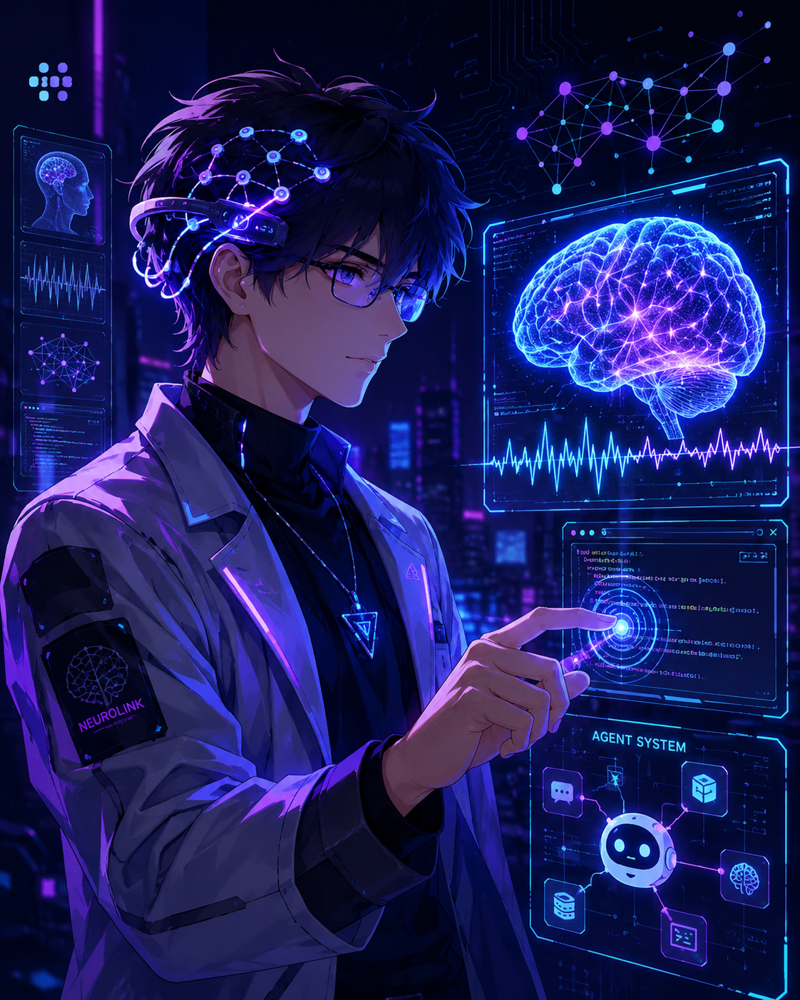

<!-- Banner -->


<!-- Right-side illustration -->
<div>
  
</div>

<!-- Header -->
# Hi, I'm yzblacia
*BCI Researcher / Master's Student / AI Explorer*
<br />

<!-- Intro -->
<p align="left">
  I am a master's student researching brain-computer interfaces, with a strong interest in artificial intelligence, large language models, and agent design.
</p>

- Currently focusing on **brain-computer interface research** and AI-driven scientific workflows.
- Interested in **BCI**, **machine learning**, **deep learning**, and **AI for neuroscience**.
- Exploring **large language models**, **agent systems**, and practical AI applications.
- Working with **Python**, **PyTorch**, **TypeScript**, and foundational ML/DL algorithms.
- Currently learning **Java** and broadening my software engineering toolbox.
- Open to discussions about **AI**, **BCI**, **LLM agents**, and research-oriented engineering.

---

<!-- Tech Stack -->
<h2 align="center">Tech Stack</h2>

<h3 align="left">Languages</h3>
<p align="left">
  
  
  
</p>

<h3 align="left">AI & Deep Learning</h3>
<p align="left">
  
  
  
  
  
</p>

<h3 align="left">Research Interests</h3>
<p align="left">
  
  
  
  
</p>

<h3 align="left">Tools</h3>
<p align="left">
  
  
  
  
</p>

---

<!-- Focus -->
<h2 align="center">Research & Learning</h2>

```text
BCI research      [##########--]  learning, experimenting, iterating
PyTorch / ML      [#########---]  modeling and implementation
LLM agents        [#######-----]  tool use, workflows, system design
Java              [####--------]  currently learning
```

<!-- Footer -->
<p align="center">
  
</p>
